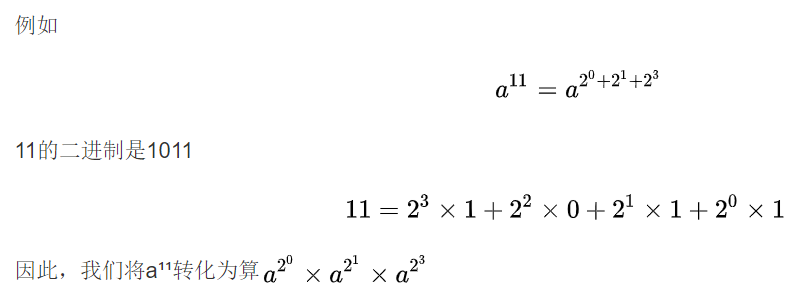
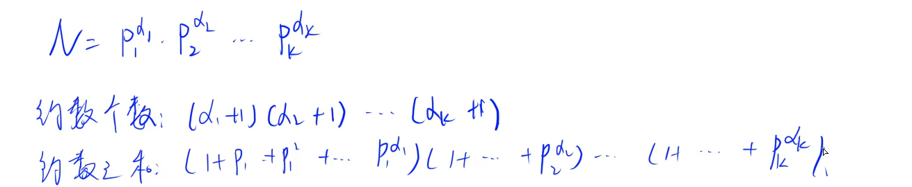

# 常用的math函数

> 1.fabs（double x） abs(int x)
>
> 2.floor(double x) //向下取整（取小）
>
> ​    ceil(double x)   //向上取整（取大）（a+b-1）/b
>
> 3.pow(double r,double p)
>
> 4.round(double x) //将x变量四舍五入  返回类型也是double
>
> 5.sqrt


# 完全平方数的性质：

>一个非完全平方数，因数个数肯定为偶数 例：8:（1,2,4,8）
>一个完全平方数，因数个数肯定为奇数 例：9:（1,3,9）

# 快速幂(求一个数的次方)



## 1、规律法

> ## 例：
>
> > b=2,p=10 k=9 
> >
> > 2^1=2 2%9=2  
> >
> > 2^2=4 4%9=4 
> >
> >  2^3=8 8%9=8  
> >
> > 2^4=16 16%9=7  
> >
> > 2^5=32 32%9=5 
> >
> >  2^6=64 64%9=1 
> >
> > 2^7=128 128%9=2
>
> 我们会发现，余数到2^7^的时候就已经跟2^1^重复了 每一个数都是一样的

### 代码

```c++
long long a,b,c;
long s=a%c;
long t=1;
for(int i=2;i<=b;i++)
{
	s=s*a%c;
    if(s==a%c) break;
    t++;
}
b%=t;
if(b==0) b=t;
s=1;
for(int i=1;i<=b;i++)
{
    s*=a%c;
    s=s%c;
}
//s即为a的b次方除c的余数
```

## 2、普通快速幂(a<10^9^,b<10^6^,1<m<10^9^)

```c++
typedef long long ll;
ll pow(ll a,llb,llm)
{
	ll ans=1;
    for(int i=0;i<b;i++)
        ans=ans*a%m;
    return ans;
}
```

## 3、二分快速幂（a<10^9^,b<10^18^,1<m<10^9^）

```c++
求 m^k mod p，时间复杂度 O(logk)。
//将k看成2进制
    
int qmi(int m, int k, int p)
{
    int res = 1 % p, t = m;
    while (k)
    {
        if (k&1) res = res * t % p; //eg:10010 若此时末位为1 则res*（m的t次方）
        t = t * t % p; //eg:10010 t随着位数增加而乘方
        k >>= 1; //eg:10010 向右移一位
    }
    return res;
}
```

## 4、快速幂的迭代写法

```c++
typedef long long ll;
ll binaryPow(ll a,ll b,ll m)
{
    ll ans=1;
    while(b>0)
    {
        if(b&1)
        {
            ans=ans*a%m;
        }
        a=a*a%m;
        b>>=1;//b=b/2;
    }
    return ans;
}
```


## 5、相关细节

> 1、如果初始时a>=m，那么需要在进入函数前就让a对m取模。
>
> 2、如果m为1，可以直接在函数外部特判为0，不需要进入函数来计算。

# 欧几里得算法（最大公约数与最小公倍数）

## 1、最大公约数

> 设a，b为正整数，则gcd(a,b)=gcd(b,a%b)

```c++
int gcd(int a,int b)
{
    return b? gcd(b,a%b):a;
}
```

## 2、最小公倍数

> a和b的最大公约数是d，则a和b的最小公倍数是**(a/d)*b**

# 分数的四则运算

## 1、分数的表示与化简

```c++
//表示：
struct Fraction{
  int up,down;  
};
```

```c++
//化简：
//1、down为非负数，如果分数为负，则up<0
//2、若分数为0，则规定其分子为0，分母为1
//3、分子分母没有除了1以外的公约数
Fraction reduction(Fracion result)
{
    if(result.down<0)
    {
        result.up=-result.up;
        result.down=-result.down;
    }
    if(result.up==0)
    {
        result.down=1;
    }
    else
    {
        int d=gcd(abs(result.up),abs(result.down));
        result.up/=d;
        result.down/=d;
    }
    return result;
}
```

## 2、分数的四则运算

```c++
//加法
Fraction add(Fraction f1,Fraction f2)
{
    Fraction result;
    result.up=f1.up*f2.down+f2.up*f1.down;
    result.down=f1.down*f2.down;
    return reduction(result);
}
//加减乘除同理
```

## 3、分数的输出

```c++
void showResult(Fraction r)
{
	r=reduction(r);
    if(r.down==1) cout<<r.up;
    else if(abs(r.up)>r.down)
    {
        cout<<r.up/r.down<<abs(r.up)%r.down<<'/'<<r.down;
    }
    else cout<<r.up<<'/'<<r.down;
}
//分子分母应用 long long 来储存
```

# 素数

## 筛法

```c++
const int maxn=101;
int prime[maxn],pNum=0;
bool p[maxn]={0};
void Find_Prime()
{
    for(int i=2;i<maxn;i++)
    {
        if(p[i]==false)
        {
            prime[pNum++]=i;
            for(int j=i+i;j<maxn;j+=i)
            {
                p[j]=true;
            }
        }
    }
}
```

# 大整数的运算

## 大整数的存储

```c++
struct bign{
    int d[1000];
    int len;
    bign()
    {
        memset(d,0,sizeof(d));
        len=0;
    }
};
bign change(char str[])
{
    bign a;
    a.len=strlen(str);
    for(int i=0;i<a.len;i++)
    {
        a.d[i]=str[a.len-i-1]-'0';
    }
    return a;
}
```

## 大整数的四则运算

```c++
//高精度加法
bign add(bign a,bign b)
{
    bign c;
    int carry=0;//进位
    for(int i=0;i<a.len||i<b.len;i++)
    {
        int temp=a.d[i]+b.d[i]+carry;
        c.d[c.len++]=temp%10;
        carry=temp/10;
    }
    if(carry!=0)
    {
        c.d[c.len++]=carry;
    }
    return c;
}
```

```c++
//高精度减法 a-b
bign sub(bign a,bign b)
{
    bign c;
    for(int i=0;i<a.len||i<b.len;i++)
    {
        if(a.d[i]<b.d[i])
        {
            a.d[i+1]--;
            a.d[i]+=10;
        }
        c.d[c.len++]=a.d[i]-b.d[i];
    }
    while(c.len-1>=1&&c.d[c.len-1]==0)
    {
        c.len--;
    }//去除高位0
    return c;
}
```

```c++
//高精度乘法
bign mulit(bign a,int b)
{
    bign c;
    int carry=0;
    for(int i=0;i<a.len;i++)
    {
        int temp=a.d[i]*b+carry;
        c.d[c.len++]=temp%10;
        carry=temp/10;
    }
    while(carry!=0)
    {
        c.d[c.len++] = carry%10;
        carry/=10;
    }
    return c;
}
```

```c++
//高精度除法
bign divide(bign a,int b,int &r)//r为余数
{
    bign c;
    c.len = a.len;
    for(int i=a.len-1;i>=0;i--)
    {
        r=r*10+a.d[i];
        if(r<b) c.d[i]=0;
        else
        {
            c.d[i]=r/b;r=r%b;
        }
    }
    while(c.len -1>=1&&c.d[len-1]==0)
    {
        c.len--;
    }
    return c;
}
```

# 进制转换

```c++
#include<iomanip>
```

> 得到一个十进制数字 
>
> cout<<hex(十六进制输出）<<num
>
> cout<<dec(十进制输出）<<num
>
> cout<<oct(八进制输出）<<num
>
> 十六进制输出默认的是小写字母，要转换为大写字母，cout<<setiosflags(ios::uppercase)<<hex

> ```
>  main(){
>     int a;
>     scanf("%x", &a);
>     printf("Hex: 0x%03X\n Decimal: %d\n Octal: %04o\n", a, a, a);
>     return 0;
> }
> ```

# 数字组合

> 有两个数a，b，则不能由这两个数组成的最大的数为：
>
> x=a*b-a-b;

# 统计一个数里有没有出现过某数字

```c++
//统计一个数里有没有出现过x
for(int i=0;i<n;i++)
{
    string s=to_string(i);
    for(int j=0;j<s.length();j++)
    {
        if(s[i]=='x') flag=1;
    }
}
```

# 全排列

```c++
int a[10]={1,2,3,4,5,6,7,8,9,10};
	do{
        for(int i=0;i<10;i++) cout<<a[i];
        cout<<endl;
    }while(next_permutation(a,a+10));
```

```c++
//组合的输出
#include<bits/stdc++.h>
using namespace std;
int x[30];//x[i]代表第i选或不选，0代表选，1代表不选
int main(){
    int n,r;
    scanf("%d%d",&n,&r);//读入n、r
    for(int i=r+1;i<=n;++i)
        x[i]=1; //赋初始值
    do{
        for(int i=1;i<=n;++i)
            if(x[i]==0) printf("%3d",i);//如果是0就输出，注意三个常宽
        printf("\n");//换行
    }while(next_permutation(x+1,x+n+1));//生成下一个
    return 0;//返回
}
```

# 求组合数

```c++
// c[a][b] 表示从a个苹果中选b个的方案数
for (int i = 0; i < N; i ++ )
    for (int j = 0; j <= i; j ++ )
        if (!j) c[i][j] = 1;
        else c[i][j] = (c[i - 1][j] + c[i - 1][j - 1]) % mod;
```

```c++
首先预处理出所有阶乘取模的余数fact[N]，以及所有阶乘取模的逆元infact[N]
如果取模的数是质数，可以用费马小定理求逆元
int qmi(int a, int k, int p)    // 快速幂模板
{
    int res = 1;
    while (k)
    {
        if (k & 1) res = (LL)res * a % p;
        a = (LL)a * a % p;
        k >>= 1;
    }
    return res;
}

// 预处理阶乘的余数和阶乘逆元的余数
fact[0] = infact[0] = 1;
for (int i = 1; i < N; i ++ )
{
    fact[i] = (LL)fact[i - 1] * i % mod;
    infact[i] = (LL)infact[i - 1] * qmi(i, mod - 2, mod) % mod;
}
```

# 卡特兰数

> 给定n个0和n个1，它们按照某种顺序排成长度为2n的序列，满足任意前缀中0的个数都不少于1的个数的序列的数量为： Cat(n) = C(2n, n) / (n + 1)

# 约数

