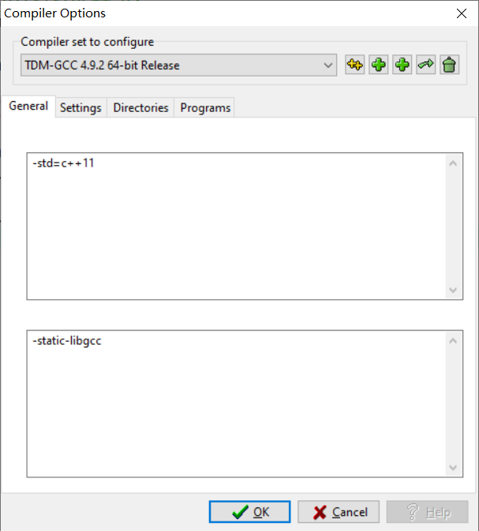

# dev引入c++11

`tools->Compiler Options`



```c++
-std=c++11
```

# 整理代码

```c++
Ctrl+Shift+A
```

# 代码补全

- 工具 
- 快捷键选项
- 最下面的Show code completion
- 把快捷键改成别的 （我选择的是Ctrl+Enter，就是选中你要更改的那项，然后直接按下你想要的组合键，自动就改了），然后确定。

# 精度问题

> ### 当题目中出现需要有高精度的输出时：
>
> 定义变量：long double
> scanf : %Lf
> pirntf : %.Lf

# 输入与输出问题

> 除非特定情况 尽量用scanf与printf （快一倍左右）（数据大于等于$10^6$）
>
> 规模小于10^5^ 使用cin、cout（cin，cout 容易超时:sob:）

## 输入多行数据 并分割进数组

```c++
#include<bits/stdc++.h>
using namespace std;

const int N = 10005;

int main()
{
	int n;
	int i = 0;
	int data[N];
	cin>>n;
	getchar();//因为后面有getline，这里要吃掉一个换行符
	while(n--)
	{
		string s;
		getline(cin,s);
		istringstream iss(s);
		string tmp;
		while(iss>>tmp)//分割字符串
		{
			data[i++] = atoi(tmp.c_str());//字符串转换为int
		}
	}
	
	for(int j = 0; j<i; j++) cout<<data[j]<<' '; 
}
```

## 输入

> ### 当需要一直输入时：
>
> while(scanf()!=-1){}
>
> while(scanf()!=EOF){}

> ### sscanf的使用：
>
> ```c++
> char str[100]="2048:3.14,hello",str2[100];
> sscanf(str,"%d:%lf,%s",&n,&db,str2);//将str中的内容写入n，db，str2
> printf("n=%d db=%.2f str2=%s\n",n,db,str2);
> ```
>
> 输出结果：
>
> ```c++
> n=2048 db=3.14 str2=hello
> ```

> ### 当输入的一串字符中有换行符：
>
> ```c++
> for(int i=1;cin>>s&&s!='E';i++)//循环读入，当读到字符E结束 
>     {
>         if(s=='W')win[i]=1; //将字符转换为数字
>         else win[i]=2; 
>     }
> ```
>

> 快读：
>
> ```c++
> inline int read(){
>    int s=0,w=1;
>    char ch=getchar();
>    while(ch<'0'||ch>'9'){if(ch=='-')w=-1;ch=getchar();}
>    while(ch>='0'&&ch<='9') s=s*10+ch-'0',ch=getchar();
>    return s*w;
> }
> ```

## 输出

> ### sprintf的使用：
>
> ```c++
> int n=12;
> double db=3.1415;
> char str[100],str2[100]="good";
> sprintf(str,"%d:%.2f,%s",n,db,str2);//将n，db，str2写入str
> printf("str=%s",str);
> ```
>
> 输出结果：
>
> ```
> str=12:3.14,good
> ```

> ### 输出的空格与换行：
>
> ```c++
> //末尾无换行
> while(t--)
> {
>     cout<<a[t];
>     if(t>0) cout<<' ';
> }
> ```
>
> ```c++
> //末尾无空格
> for(int i=0;i<n;i++)
> {
>     cout<<a[i];
>     if(i<n-1) cout<<' ';
>     else cout<<endl;
> }
> ```


# 定义变量问题

> 不加 long long 见祖宗

# 浮点数的比较

> ### 1、== 运算符
>
> 由于浮点数存储不精确，我们引入一个极小数eps来修正误差，经验表明eps取1e-8比较合适
>
> ```c++
> const double eps = 1e-8;
> #define Equ(a,b) ((fabs((a)-(b))))<(eps))
> ```
>
> ### 2、> ，< 运算符
>
> ```c++
> #define More(a,b) (((a)-(b))>(eps))
> #define Less(a,b) (((a)-(b))<(-eps))
> ```
>
> ### 3、>= ,<= 运算符
>
> ```
> #define MoreEqu(a,b) (((a)-(b))>(-eps))
> #define LessEqu(a,b) (((a)-(b))<(eps))
> ```
>
> ### 4、圆周率
>
> ```c++
> const double Pi = acos(-1.0);
> ```

# 数组大小

>- 全局数组能开到20000*20000*
>- *函数中的char数组最大能开4*518028
>- int最大能开到518028
>- static能开到107*107//static和 全局开的是同一块空间

# Tips

> set 去重