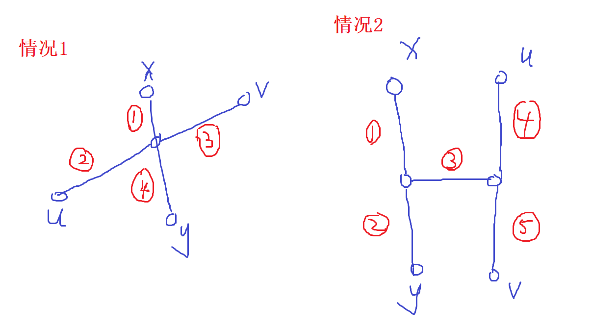

# 核心思想

>1.深度优先搜索（DFS）：从某个状态开始，不断转移，直至无法转移，回退到前一步，再继续转移到其他状态，直到找到最终解。通常采用递归函数或者栈（Stack）来实现。
>
>2.宽度优先搜索（BFS）：从初始状态开始，总是先搜索至距离初始状态近的状态。每个状态都只经过一次，因此复杂度为O(状态数*转移方式数)。通常采用循环或队列（Queue）实现。

# 方向准备：

```c++
int xx[]={0,0,1,-1},
	yy[]={1,-1,0,0};
```

```c++
for(int i=0;i<4;i++)
{
	int dx = x.front()+xx[i];
	int dy = y.front()+yy[i];
}
```


# DFS

> **一共有几条路径**

## 例：

## 1.八皇后

```c++
#include<bits/stdc++.h>
using namespace std;

int n,cnt;
bool a[20];//列
bool b[20];//右斜
bool c[40];//左斜
int s[20];

void pr()
{
	for(int i=1;i<=n;i++)
    {
		cout<<s[i]<<' ';
	}
	cout<<endl;
	
}
void dfs(int x)
{
	if(x>n)
	{
		cnt++;
		pr();
	}
	else 
	{
		for(int i=1;i<=n;i++)//行
		{
			if(!a[i]&&!b[x-i+n]&&!c[x+i])
			{
				a[i]=1;
				b[x-i+n]=1;
				c[x+i]=1;
				s[x]=i;
				dfs(x+1);
				a[i]=0;
				b[x-i+n]=0;
				c[x+i]=0; 
			}
		}
	}
}
 
int main()
{
	cin>>n;
	dfs(1);
	cout<<cnt;
}
```

## 2.迷宫

#### 题目背景

> 给定一个N*M方格的迷宫，迷宫里有T处障碍，障碍处不可通过。给定起点坐标和终点坐标，问: 每个方格最多经过1次，有多少种从起点坐标到终点坐标的方案。在迷宫中移动有上下左右四种方式，每次只能移动一个方格。数据保证起点上没有障碍。

#### 输入格式

> 第一行N、M和T，N为行，M为列，T为障碍总数。第二行起点坐标SX,SY，终点坐标FX,FY。接下来T行，每行为障碍点的坐标。

#### 代码

```c++
#include<bits/stdc++.h>
using namespace std;

int n,m,t,sx,sy,fx,fy,cnt;
bool vis[10][10];
bool mp[10][10];
int x[]={0,0,1,-1};
int y[]={1,-1,0,0};

void dfs(int sx,int sy)
{
	if(sx==fx&&sy==fy)
	{
		cnt++;
		return;
	}
	for(int i=0;i<4;i++)
	{
		int dx = sx + x[i];
		int dy = sy + y[i];
		if(!vis[dx][dy]&&dx>=1&&dx<=n&&dy>=1&&dy<=m&&!mp[dx][dy])
		{
			vis[dx][dy]=1;
			dfs(dx,dy);
			vis[dx][dy]=0;
		}
	}
}
int main()
{
	cin>>n>>m>>t>>sx>>sy>>fx>>fy;
	while(t--)
	{
		int x,y;
		cin>>x>>y;
		mp[x][y]=1;
	}
	vis[sx][sy]=1;
	dfs(sx,sy);
	cout<<cnt;
}
```

## 3、[SHOI2002]滑雪（记忆化搜索）

>### 题目描述
>
>Michael 喜欢滑雪。这并不奇怪，因为滑雪的确很刺激。可是为了获得速度，滑的区域必须向下倾斜，而且当你滑到坡底，你不得不再次走上坡或者等待升降机来载你。Michael 想知道在一个区域中最长的滑坡。区域由一个二维数组给出。数组的每个数字代表点的高度。下面是一个例子：
>
>>```
>>1   2   3   4   5
>>16  17  18  19  6
>>15  24  25  20  7
>>14  23  22  21  8
>>13  12  11  10  9
>>```
>
>一个人可以从某个点滑向上下左右相邻四个点之一，当且仅当高度会减小。在上面的例子中，一条可行的滑坡为 24－17－16－1（从 24 开始，在 1 结束）。当然 25－24－23 - … - 3－2－1 更长。事实上，这是最长的一条。

#### 代码

```c++
#include<bits/stdc++.h>
using namespace std;

int dx[4]={0,0,1,-1};
int dy[4]={1,-1,0,0};

int n,m,a[201][201],s[201][201],ans;

int dfs(int x,int y){
    if(s[x][y])return s[x][y];//记忆化搜索
    s[x][y]=1;//题目中答案是有包含这个点的
    for(int i=0;i<4;i++)
    {  int xx=dx[i]+x;
       int yy=dy[i]+y;
       if(xx>0&&yy>0&&xx<=n&&yy<=m&&a[x][y]>a[xx][yy]){
          dfs(xx,yy);
          s[x][y]=max(s[x][y],s[xx][yy]+1);
       }
    }
    return s[x][y];
}

int main()
{   
   scanf("%d%d",&n,&m);
   for(int i=1;i<=n;i++)
     for(int j=1;j<=m;j++)
       scanf("%d",&a[i][j]);
    for(int i=1;i<=n;i++)//找从每个出发的最长距离
      for(int j=1;j<=m;j++)
        ans=max(ans,dfs(i,j));//取最大值
    printf("%d",ans);
    return 0;
}
```


# BFS

> **广搜常用于找单一的最短路线，或者是规模小的路径搜索，它的特点是"搜到就是最优解"**

```c++
1、判重数组 st[]
2、queue
    queue<-初始状态
    while(!queue.empty())
    {
        t<-队头
        for(扩展t)
        {
            ver<-新节点
            if(!st[ver])
            {
                ver->队尾
            }
        }
    }
```


## 例：

### 1、马的遍历

> 有一个n*m的棋盘(1<n,m<=400)，在某个点上有一个马,要求你计算出马到达棋盘上任意一个点最少要走几步


```c++
#include<bits/stdc++.h>
using namespace std;

int n,m,sx,sy,ans;
int xx[]={1,1,-1,-1,2,2,-2,-2};
int yy[]={2,-2,2,-2,1,-1,1,-1};
struct node{
	int x;
	int y;
	int s;
};
queue< node > q;
int mp[405][405];

int main()
{
	memset(mp,-1,sizeof(mp));
	cin>>n>>m>>sx>>sy;
	mp[sx][sy]=0;
	q.push((node) {sx,sy,0});
	while(!q.empty())
	{
		for(int i=0;i<8;i++)
		{
			int dx=q.front().x+xx[i];
			int dy=q.front().y+yy[i];
			if(dx>=1&&dx<=n&&dy>=1&&dy<=m&&mp[dx][dy]==-1)
			{
				mp[dx][dy]=q.front().s+1;
				q.push((node){dx,dy,q.front().s+1});
			}
		}
		q.pop();
	}
	for(int i=1;i<=n;i++)
	{
		for(int j=1;j<=m;j++)
		{
			cout<<left<<setw(5)<<mp[i][j];
		}
		cout<<endl;
	}
	
}
```

# 树的直径：树中长度最长的路径

1、任取一点x

2、找到距离x最远的点y

3、从y开始遍历，找到离y最远的点，与y最远的点的距离是树的直径

证明：y一定是树的直径的端点

假设y不是树的直径的端点，分两种情况，如图所示，其中uv是树的直径



情况1：xy与uv有交点，由于离x最远的点是y，因此

有 1 + 3 <= 3 + 4

即 3 <= 4

则 3 + 2 <= 4 + 2

由于 3 + 2是树的直径，因此4 + 2一定是树的直径，因此y不是树的直径的端点矛盾

情况2:xy与uv没有交点，由于离x最远的点是y，因此

有 1 + 2 >= 1 + 3 + 5

即 2 >= 3 + 5

即 2 > 5

则 2 + 3 > 5

则 2 + 3 + 5 > 4 + 5

由于 4 + 5是树的直径，但存在着一个长度更长的路径，因此y不是树的直径的端点矛盾

因此，y一定是树的直径的端点

# 最大环

> 题目描述
>
> 班里N个小朋友，每个人都有自己最崇拜的一个小朋友（也可以是自己）。
> 在一个游戏中，需要小朋友坐一个圈，
> 每个小朋友都有自己最崇拜的小朋友在他的右手边。
> 求满足条件的圈最大多少人？
>
> 小朋友编号为1,2,3,...N
>
> 输入
>
> 输入第一行，一个整数N（3<N<100000）
> 接下来一行N个整数，由空格分开。
>
> 输出
>
> 要求输出一个整数，表示满足条件的最大圈的人数。
>
> 样例输入
>
> ```
> 9
> 3 4 2 5 3 8 4 6 9
> ```
>
> 样例输出
>
> ```
> 4
> ```

```c++
#include<bits/stdc++.h>
using namespace std;
const   int N=100010;
int duin[N];
int a[N];
bool st[N];
int main()
{
    int n;
    cin>>n;
    for(int i=1;i<=n;i++)
    {
        cin>>a[i];
    	duin[a[i]]++;
    }
    for(int i=1;i<=n;i++)//先把度为0的点删掉(即将st设为true)，然后连锁反应
    {
        if(st[i])   continue;
        if(duin[i]==0) 
        {
            st[i]=true;
            int t=a[i];
            while(--duin[t]==0)
            {
                st[t]=true;
                t=a[t];
            }
        }
    }
    int maxv=0;
    for(int i=1;i<=n;i++)
    {
        if(st[i])   continue;
        int tt=1;
        int t=a[i];
        while(i!=t)
        {
            tt++;
            st[t]=true;
            t=a[t];
        }
        maxv=max(maxv,tt);
    }
    cout<<maxv<<endl;
    return 0;
}
```

